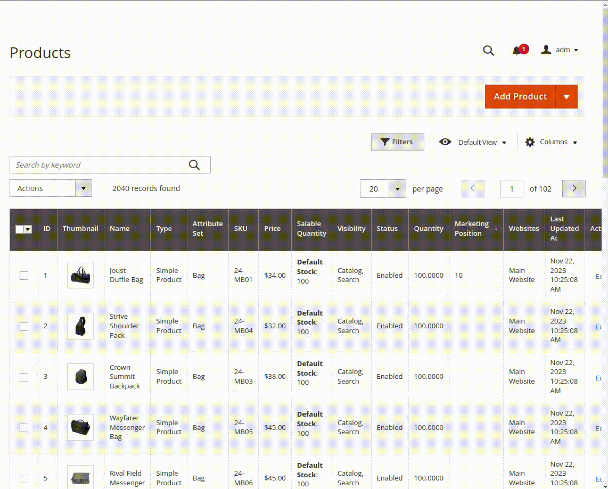

# OP | QUICK PRODUCT POSITIONING MODULE

You can check the requirements of this module in the following [link](doc/requiriments.md)

## Table of contents
- [Intro](#intro)
- [Install](#install)
  - [Clone Script](#clone-script-)
  - [Clone Manual](#clone-manual)
- [Developer documentation](#developer-documentation)
- [Pending](#pending)
    
## Intro

Omni pro Quick Product Positioning, offers the possibility of managing those featured products in a quick and easy way without having technical skills, any member of the marketing team can manage the products as required



## Install 
The installation process is very simple and we provide two alternatives

### Clone Script 

```sh
# Go to the root directory of your project
cd ${project}

# Run the following script
curl -o- https://raw.githubusercontent.com/integraciones-omnipro/maximo-marucci/main/bin/install.sh | bash
```

### Clone Manual
To install the module by manual cloning follow the following steps

```sh
# Go to the root directory of your project
cd ${project}

# Check if you have the supplier folder Omnipro
ls -la | egrep app/code/omnipro/QuickProductPositioning 

# Otherwise believe it
mkdir -p app/code/omnipro/QuickProductPositioning 
cd $_

# Clone this repository
git clone https://github.com/integraciones-omnipro/maximo-marucci.git app/code/omnipro/QuickProductPositioning


# Run the following commands
# Depending on your environment, the way to update your implementation may vary.

magento module:enable Omnipro_QuickProductPositioning
magento s:up
magento c:c
```

### Composer

This option is not currently available for this module

## Developer documentation
You can find the documentation for the developer and a short explanation of how this module works in the following [link](doc/developer.md)


## Pending 

**Explicitos**
- Columna debe tener la posibilidad de ordenar de forma asc-desc
- El campo editable debe tener utilizar el componente input con controles para incrementar y decrementar su valor

**Implicitos - oportunidad de mejora**
- El path de settings aun no esta implementado en las reglas del modulo
- Se debe considerar la posibilidad de agregar massacctions
  - Accion de edicion general
  - Accion que aplique filtro solo de elementos con posicion destacada
  - Accion de limpieza general de las posiciones
- Al recibir valor null empty en position value, debe eliminarse de la tabla auxiliar 
- Agregar testing para validar que source obtiene position_value como un campo por cada row
- Correr codingstandard segun la version implementada
